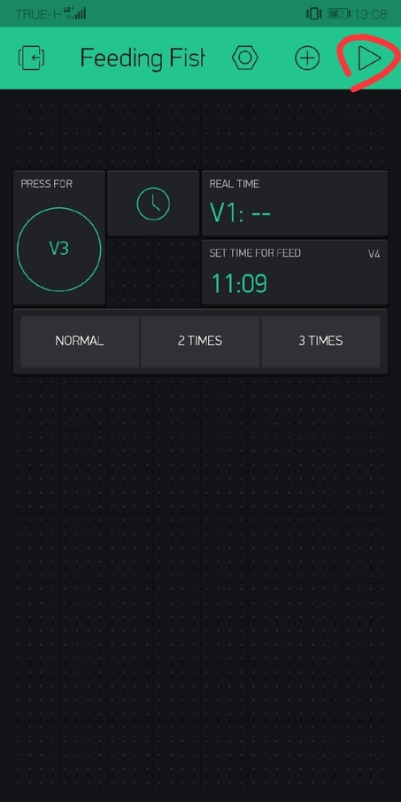

#  Automatic Fish Feeding
การพัฒนาโครงการ automatic fish feeding เกิดมาจากการเล็งเห็นถึงปัญหาในชีวิตประจำวันของผู้เลี้ยงปลา โดยความยุ่งยากในการให้อาหารปลา ทั้งด้านเวลาและความไม่สะดวกจากการเรียนหรือทำงาน ดังนั้นจึงได้คิดประดิษฐ์เครื่องให้อาหารอัตโนมัติ เพื่อช่วยอำนวยความสะดวกในการให้อาหารปลา เพื่อลดเวลาในการทำงาน โดยเครื่องให้อาหารเม็ดอัตโนมัตินี้สามารถตั้งโปรแกรมเพื่อกำหนดเวลาการให้อาหารหรือจะสามารถควบคุมสั่งการ การให้อาหารในแต่ละวันได้จากระยะไกลโดยที่ผู้ใช้ไม่จำเป็นต้องกลับมายังที่พัก และภายในหนึ่งวันสามารถให้อาหารได้มากกว่าหนึ่งครั้ง
## Hardware components
* ESP8266
* Servo
* Jumper Wires 
* หลอดไฟ RGB
* กล่องใส่อาหาร
## Software apps and online services
* Arduino IDE
* Application BLYNK
## Feature
* สั่งการระยะไกลผ่าน WIFI
* ควบคุมโดย Application Blynk ในมือถือ
* ระบบตั้งเวลาให้อาหาร
## Installation & Setting Blynk
1. ดาวน์โหลด Application Blynk จาก App Store
2. ใช้ Blynk สแกน QR Code นี้ เพื่อ Clone การควบคุม Project 

3. จากนั้นจะแสดงผลดังนี้ ให้กดเข้าไปที่ ตัวน็อตซึ่งจะเป็น menu setting 

4. กด Email all ดังรูปเพื่อส่ง Token ไปที่ Email 

5. หลังจากเข้าไป Copy Token จาก Email แล้ว ให้นำไปใส่ใน Source Code ดังนี้ 

6. เมื่อแก้ไขและ Upload ไปที่บอร์ดแล้ว ให้กดปุ่มสามเหลี่ยมด้านขวาบนจะเข้าไปหน้าใช้งาน 

## How to use
สามารถรับชมตัวอย่างการใช้งานได้จากคลิปด้านล่าง
URL : https://www.youtube.com/watch?v=Tpnlty0UGdk 

## Team Members
|  |ชื่อ|นามสกุล|GitHub Username|รหัสนักศึกษา|
|:-:|--|------|---------------|---------|
||ณภัทร|พรบุญเรือง|[@61070044](https://github.com/61070044)|61070044|
||ทศวรรษ|จันทะพิทักษ์|[@jfornqz](https://github.com/jfornqz)|61070065|
||ธรรมสรณ์|ตันติยาภินันท์|[@tangtms](https://github.com/tangtms)|61070084|
||ธิติวุฒิ|โตสงวน|[@l3luehunter](https://github.com/l3luehunter)|61070087|
